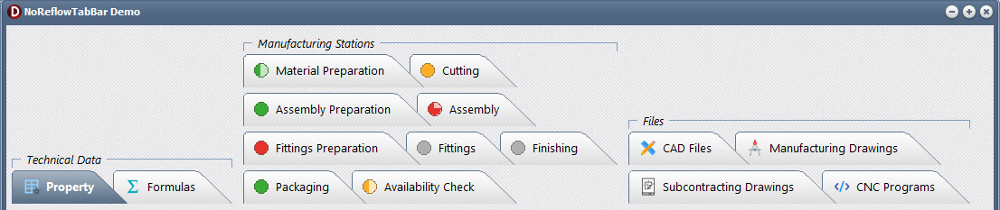
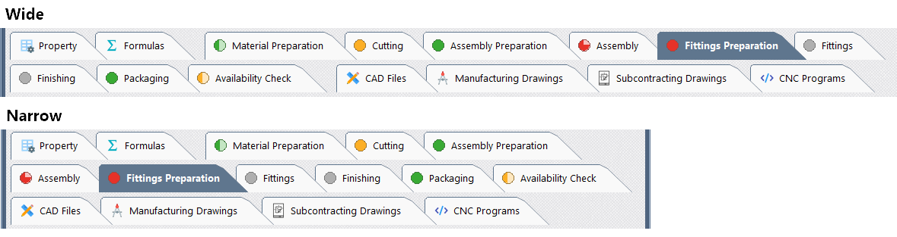
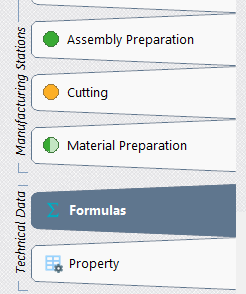
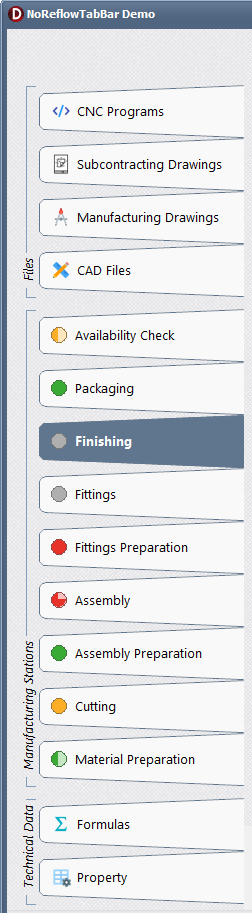
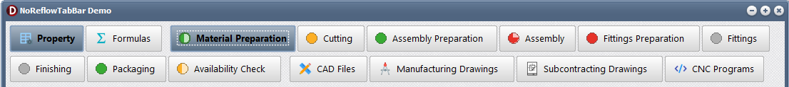
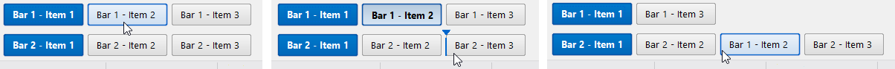
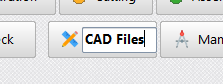

# NoReflowTabBar

**NoReflowTabBar** is a VCL component for Delphi applications that provides a stable multi-row tab, button and navigation bar.

It was originally designed to solve a specific usability problem found in some multi-line tab controls: when the user selects a tab, the visual arrangement can change and the clicked item may move. NoReflowTabBar keeps item placement predictable and avoids disruptive row reflow during selection.

The component has since evolved into a more complete navigation surface with grouped zones, multiple behaviour modes, drag and drop reordering, inter-bar moves, glyphs, status indicators, inline caption editing, custom rendering and layout persistence support.

## Main features

- Stable multi-row tab layout
- Horizontal and vertical bar positions
- Logical item zones: start, center and end
- Optional zone headers
- Tab, push-button, selectable-button and check-button modes
- Glyph and image list support
- Status indicators, also called signals
- Standard and user-defined signal colors
- Drag and drop reordering inside a bar
- Optional drag and drop between compatible bars
- Optional drag restrictions by zone
- Inline caption editing with validation events
- Pluggable inline caption editor architecture
- Optional [VclRotatedEdit](https://github.com/mbaumsti/VclRotatedEdit) adapter for rotated inline editing
- Item hints and custom hint events
- Layout save and restore support
- Flat and gradient rendering modes
- Style-aware and custom palettes
- Style-aware design-time rendering using the parent style context
- Shape options such as slants, radius and overlap
- Robust constrained-size handling with text ellipsis
- Signal-first fallback rules when space is limited
- Keyboard focus rendering
- Design-time published properties
- Runtime and design-time Delphi packages
- No dependency on large third-party component suites

## Screenshots

### Overview



### Responsive no-reflow layout



### Vertical orientation





### Button modes



### Multi-bar drag and drop



### Inline editing




## Why NoReflowTabBar?

Classic tab controls work well for simple interfaces, but they become limiting when an application needs many visible entries, grouped commands, stable multi-row behaviour or user-customisable navigation.

NoReflowTabBar focuses on predictable layout and practical VCL integration. It can be used as a tab bar, a navigation bar, a command bar, a grouped menu replacement or a configurable workflow selector.

Typical use cases include:

- replacing a complex hand-made menu panel;
- grouped application navigation;
- multi-row document or module selection;
- production or workflow station navigation;
- user-customisable command bars;
- vertical side navigation;
- filter bars with checkable entries.

## Layout and zones

Items can be assigned to one of three logical zones:

- `Start`
- `Center`
- `End`

Zones make it possible to keep unrelated navigation entries or commands visually separated while still using a single component. Each zone can optionally display a header.

The layout engine can arrange items sequentially or by zones, depending on the desired behaviour. It also supports flow order, alignment, common item length, common item thickness, forced logical length, forced logical thickness, overlap and orientation options.

When item size is constrained, the content layout engine applies stable fallback rules instead of letting visual elements overlap. Status signals are preserved as much as possible, glyphs may be hidden first, and captions are ellipsized when needed. This is especially useful in button modes where `ForcedLength` or `ForcedThickness` are used to create compact command bars.

When the component is rendered in style-aware mode, design-time rendering resolves the visual style from the parent context first. This makes the component preview closer to the actual styled VCL surface shown by the form designer.

## Behaviour modes

The same component can be used in several UI patterns.

### Tab mode

Classic single-selection tab behaviour. This is useful for page switching, view switching or document-like navigation.

### Push button mode

Button-like behaviour without persistent selection. This is useful for commands or action launchers.

### Selectable button mode

Button rendering with single-selection behaviour. This is useful for module selectors or navigation bars.

### Check button mode

Independent checked states for each item. This is useful for filters, toggles or display options.

## Drag and drop

NoReflowTabBar can reorder items by drag and drop. Depending on the configured mode, reordering can be disabled, limited to the same zone, or allowed between all enabled zones.

The component also supports drag and drop between compatible bars. Applications can accept or reject moves through events such as reorder and drop validation callbacks.

## Signals and glyphs

Items can display glyphs from an image list and additional status indicators called signals.

Signals are useful for representing item state without changing the caption, for example:

- warning or error states;
- workflow status;
- document state;
- production state;
- custom application-specific markers.

Signal definitions are stored at bar level and items reference them by signal code.

When the available item size is constrained, signals are treated as important status information. The layout engine tries to keep the signal visible before falling back to shortened text, because the full caption can usually still be exposed through the item hint.

## Inline editing

Item captions can optionally be edited directly inside the bar.

Inline editing can be enabled globally and restricted by zone. The component also exposes events to decide whether a caption can be edited, validate the new caption and react after a successful edit.

The default inline editor is a standard VCL `TEdit`, so NoReflowTabBar works out of the box without any additional component dependency.

The inline editor layer is extensible. NoReflowTabBar exposes a small editor abstraction used to pass the text center, logical text length, logical text thickness and text orientation to the active editor. This keeps the bar responsible for layout and lets each editor decide how to position itself.

This architecture is used by the optional [VclRotatedEdit](https://github.com/mbaumsti/VclRotatedEdit) adapter. When that adapter is installed and referenced by the application, vertical captions can be edited with `TRotatedEdit` instead of a standard horizontal `TEdit`.


## Optional VclRotatedEdit adapter

NoReflowTabBar itself does not require [VclRotatedEdit](https://github.com/mbaumsti/VclRotatedEdit). The main runtime and design-time packages remain independent and can be installed on their own.

An optional adapter is provided under:

```text
Optional_Packages/VclRotatedEdit/
```

This adapter allows NoReflowTabBar to use `TRotatedEdit` as its inline caption editor. It is useful when captions are displayed vertically and the editor should follow the same visual direction as the item text.

The optional adapter requires both components to be available. `VclRotatedEdit` is available at [https://github.com/mbaumsti/VclRotatedEdit](https://github.com/mbaumsti/VclRotatedEdit).

- `NoReflowTabBarR`
- `NoReflowTabBarDesign`
- `VclRotatedEditR`
- `VclRotatedEditDesign`

The optional adapter packages are:

```text
Optional_Packages/VclRotatedEdit/Packages/NoReflowTabBarVclRotatedEditAdapterR.dpk
Optional_Packages/VclRotatedEdit/Packages/NoReflowTabBarVclRotatedEditAdapterDesign.dpk
```

For applications compiled without runtime packages, add the adapter unit to the project uses clause to activate it at runtime:

```pascal
uses
  NoReflowTabBar_VclRotatedEditAdapter;
```

Without this optional adapter, NoReflowTabBar continues to use the standard `TEdit` inline editor.

## Persistence

NoReflowTabBar supports saving and restoring layout-related state.

Applications can use this to persist user customisation such as item order, item zones, selected item, checked states and other layout-related information depending on the selected persistence strategy.

The persistence layer is not tied to a specific storage backend. Applications can store the data in memory, an INI file, the registry, XML, a database or any custom storage system.

## Demo application

The repository includes a VCL demo application that demonstrates the main features of the component.

The demo is intentionally defined mostly in the DFM file. Runtime code is limited to behaviour, option application, event logging and local in-memory snapshots used by reset buttons.

The demo covers:

- overview and basic selection;
- layout and zone options;
- forced item length/thickness and text ellipsis;
- zone headers;
- item shape options;
- signal definitions and custom signal colors;
- event logging;
- tab and button modes;
- drag and drop scenarios;
- layout persistence examples;
- inline caption editing.

## Repository structure

```text
NoReflowTabBar/
├─ Src/
│  ├─ NoReflowTabBar.pas
│  ├─ NoReflowTabBar_Core.pas
│  ├─ NoReflowTabBar_Items.pas
│  ├─ NoReflowTabBar_CommonTypes.pas
│  ├─ NoReflowTabBar_EventsTypes.pas
│  ├─ NoReflowTabBar_AppearanceAndLayout.pas
│  ├─ NoReflowTabBar_RenderTypes.pas
│  ├─ NoReflowTabBar_RenderSupport.pas
│  ├─ NoReflowTabBar_LayoutSupport.pas
│  ├─ NoReflowTabBar_ZoneLayout.pas
│  ├─ NoReflowTabBar_ZoneHeader.pas
│  ├─ NoReflowTabBar_DragSupport.pas
│  ├─ NoReflowTabBar_CaptionEditor.pas
│  ├─ NoReflowTabBar_EditSupport.pas
│  ├─ NoReflowTabBar_HintSupport.pas
│  ├─ NoReflowTabBar_StorageSupport.pas
│  ├─ NoReflowTabBar_Library.pas
│  └─ NoReflowTabBarReg.pas
├─ Packages/
│  ├─ NoReflowTabBarR.dpk
│  └─ NoReflowTabBarDesign.dpk
├─ Optional_Packages/
│  └─ VclRotatedEdit/
│     ├─ README.md
│     ├─ Src/
│     │  ├─ NoReflowTabBar_VclRotatedEditAdapter.pas
│     │  └─ NoReflowTabBar_VclRotatedEditAdapterReg.pas
│     └─ Packages/
│        ├─ NoReflowTabBarVclRotatedEditAdapterR.dpk
│        └─ NoReflowTabBarVclRotatedEditAdapterDesign.dpk
├─ Demo/
│  ├─ NoReflowTabBarDemo.dpr
│  ├─ NoReflowTabBarDemo.dproj
│  ├─ NoReflowTabBarDemoMain.pas
│  └─ NoReflowTabBarDemoMain.dfm
├─ docs/
│  ├─ getting-started.md
│  ├─ core-concepts.md
│  ├─ layout-and-zones.md
│  ├─ item-modes.md
│  ├─ drag-and-drop.md
│  ├─ signals-and-glyphs.md
│  ├─ inline-editing.md
│  ├─ persistence.md
│  ├─ api-introduction.txt
│  └─ api-complete-introduction.txt
├─ pasdoc-public.cfg
├─ pasdoc-complete.cfg
├─ pasdoc-sources-public.txt
├─ pasdoc-sources-complete.txt
├─ PASDOC_README.md
├─ README.md
├─ LICENSE
└─ .gitignore
```

## Installation

The repository contains separate runtime and design-time packages.

Typical installation steps:

1. Open the project group or the package files in Delphi.
2. Build the runtime package:
   - `Packages/NoReflowTabBarR.dpk`
3. Build and install the design-time package:
   - `Packages/NoReflowTabBarDesign.dpk`
4. Add the `Src` folder to the library/search path if needed by your project setup.
5. Drop `TNoReflowTabBar` on a VCL form and configure its published properties from the Object Inspector.

Package setup may vary depending on your local Delphi configuration.

### Optional VclRotatedEdit adapter installation

The optional [VclRotatedEdit](https://github.com/mbaumsti/VclRotatedEdit) adapter is not required for the main component. Install it only if you want NoReflowTabBar to use `TRotatedEdit` for inline caption editing.

Typical optional installation steps:

1. Download or clone [VclRotatedEdit](https://github.com/mbaumsti/VclRotatedEdit), then build and install its runtime and design-time packages.
2. Build and install NoReflowTabBar runtime and design-time packages.
3. Build the optional runtime adapter:
   - `Optional_Packages/VclRotatedEdit/Packages/NoReflowTabBarVclRotatedEditAdapterR.dpk`
4. Build and install the optional design-time adapter:
   - `Optional_Packages/VclRotatedEdit/Packages/NoReflowTabBarVclRotatedEditAdapterDesign.dpk`
5. For applications compiled without runtime packages, add `NoReflowTabBar_VclRotatedEditAdapter` to the project uses clause.

## Documentation

The documentation is split into focused Markdown guides under the `docs` folder.

Suggested starting points:

- [Getting started](docs/getting-started.md)
- [Core concepts](docs/core-concepts.md)
- [Layout and zones](docs/layout-and-zones.md)
- [Item modes](docs/item-modes.md)
- [Drag and drop](docs/drag-and-drop.md)
- [Signals and glyphs](docs/signals-and-glyphs.md)
- [Inline editing](docs/inline-editing.md)
- [Persistence](docs/persistence.md)

## API reference

The source comments are prepared for PasDoc.

Two PasDoc configurations are provided:

- `pasdoc-public.cfg` generates the public API reference intended for application developers.
- `pasdoc-complete.cfg` generates a complete maintainer reference including internal support layers and the design-time registration unit.

Generate the public API reference from the repository root:

```bat
pasdoc @pasdoc-public.cfg
```

Output:

```text
docs\api\
```

Generate the complete maintainer reference from the repository root:

```bat
pasdoc @pasdoc-complete.cfg
```

Output:

```text
docs\api-complete\
```

The public HTML reference generated in `docs\api\` is intended to be distributed with the repository so developers can browse the API without installing PasDoc.

The complete maintainer reference generated in `docs\api-complete\` is ignored by `.gitignore` by default, because it includes internal support layers and is mainly useful during project maintenance.

## Requirements

- Delphi 12.2 or later is recommended.
- VCL desktop application.
- Windows.
- [VclRotatedEdit](https://github.com/mbaumsti/VclRotatedEdit) is optional and only required for the optional rotated inline editor adapter.

NoReflowTabBar is currently developed and tested with Delphi 12.2. Compatibility with earlier Delphi versions has not been validated yet.

## License

NoReflowTabBar is distributed under the Mozilla Public License 2.0.

This allows the component to be used in open-source and commercial Delphi VCL applications, while requiring distributed modifications to the component source files themselves to remain available under the same license.

See the `LICENSE` file for details.
